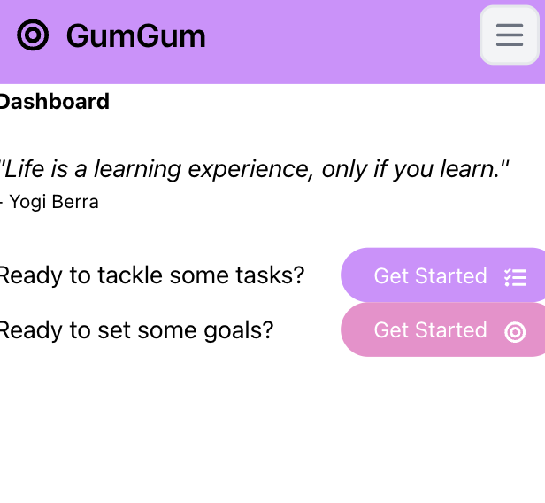
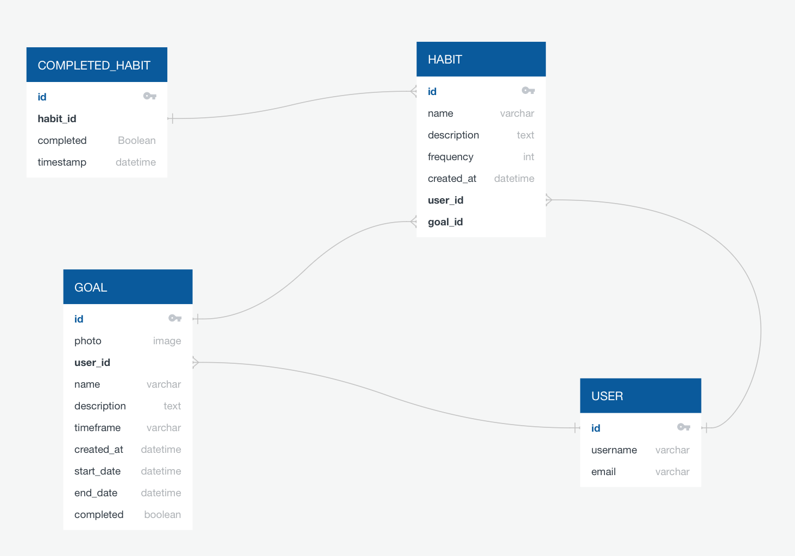
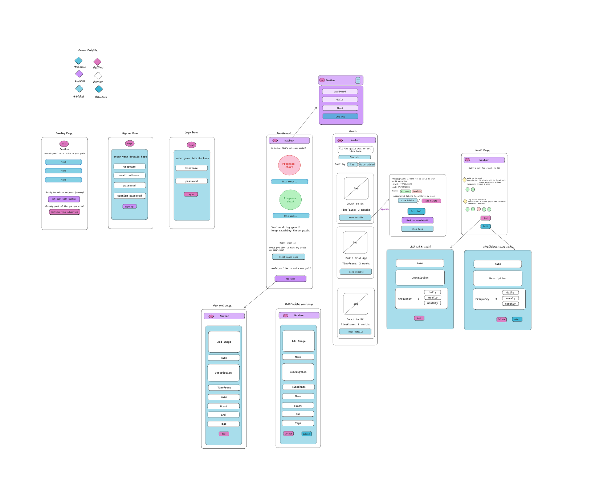
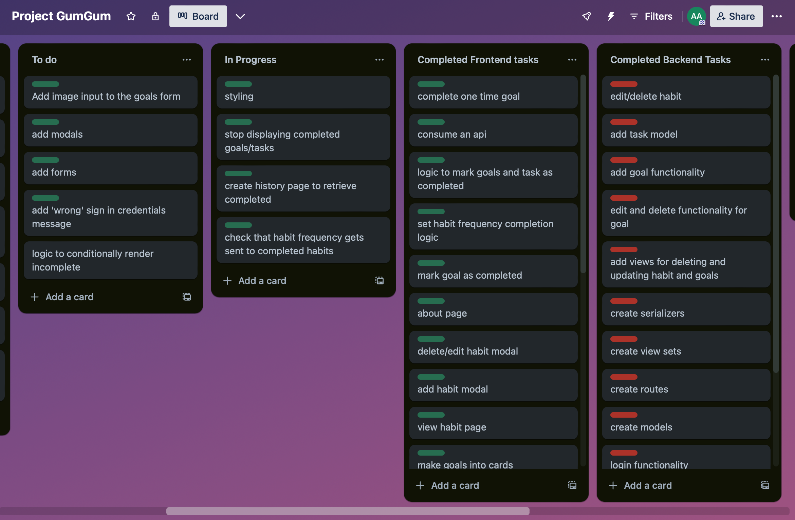

# GumGum - Achieve Big Goals with Micro Habits



## Table of Contents

1. [Introduction](#introduction)
2. [Deployment](#deployment)
3. [Installation](#installation)
4. [Technologies Used](#technologies-used)
5. [Project Overview](#project-overview)
   - [Solo Project Timeline](#solo-project-timeline)
   - [Brief](#brief)
   - [Planning Stages](#planning-stages)
   - [Build and Code Process](#build-and-code-process)
6. [Challenges and Wins](#challenges-and-wins)
7. [Key Learning/Takeaways](#key-learning/takeaways)
8. [Future Improvements](#future-improvements)
9. [Known Bugs](#known-bugs)

---

## Introduction

GumGum is a productivity app designed to help users achieve significant goals by breaking them down into manageable micro habits. Inspired by the principles of "Atomic Habits" by James Clear, GumGum provides a platform for users to transform their dreams into daily victori
## Deployment

The app is deployed and accessible online at [GumGum](https://project4-frontend-production-dadf.up.railway.app).

## Installation

To run GumGum locally, follow these steps:

1. Clone the repository:

   ```bash
   git clone git@github.com:AishaA14/Project4-frontend.git
   
Navigate to the project directory:
```bash
cd gumgum
```
Install dependencies:
```bash
npm install
```
Start the development server:
```bash
npm start
```
The app will be available at http://localhost:3000 by default.

## Technologies Used

GumGum is built using the following technologies:

Frontend:
React
Tailwind CSS for styling
Backend:
Django
PostgreSQL for the database
Deployment:
Railway
Project Overview

## Solo Project Timeline
GumGum was developed within a one-week timeframe as a solo project. The tight schedule was aimed at challenging the efficiency and productivity of the development process.

## Brief
The project's brief was to create a productivity app using Django and React, with specific requirements including full-CRUD operations, PostgreSQL database usage, third-party API integration, authentication, and authorization.

## Planning Stages
The planning stages involved initial sketches and diagrams to visualize the app's structure and features. QuickDatabaseDiagrams.com was utilized to create entity-relationship diagrams for the database structure.



Excalidraw was also used to create a wireframe of the flow of the application and visualise the User Interface.



I used a Trello Board to manage and prioritise tasks.




## Build and Code Process
The build and code process followed an iterative approach, focusing on implementing core features first and gradually adding additional functionalities. Both frontend and backend development were carried out concurrently.

** One of the core features of the app to implement was user authenitcation. This was carried out by creating a react component in the front end that will consume an endpoint on the backend responsible for generating the users access token.

Code snippet of the front end logic.
```js
 const { data } = await axios.post(`${backendUrl}/token/`, user,
    {
      headers: { "Content-Type": "application/json" },
    },
    {
        withCredentials: true
    },
    );

    // Initialize the access & refresh token in localstorage.
    localStorage.clear();
    localStorage.setItem("access_token", data.access);
    localStorage.setItem("refresh_token", data.refresh);
    axios.defaults.headers.common["Authorization"] = `Bearer ${data["access"]}`;

```

Another key feature of the app was the ability to visualise the completion of habits. The user is able to mark the habit as completed which then allows them to see a bar chart of the frequency of completion in the last 7 days.

Here is some code showing the logic behind marking as completed.

```js
const handleMarkAsCompleted = async (habitId) => {
    try {
      // Check if the habitId is already in the completedHabits state
      if (!completedHabits[habitId]) {
        // If not completed, set the count to 1
        setCompletedHabits((prevCompletedHabits) => ({
          ...prevCompletedHabits,
          [habitId]: {
            count: 1,
          },
        }));
  
        // Save the completion in your backend (call API endpoint to save completion)
        await axios.post(
          `${backendUrl}/completed_habits/`,
          {
            habit: habitId,
            count: 1, // Initial count for a new completion
            // include completion date
          },
```

On the backend implementing the models, serializers, the api end point that the rect frontend will communicate with and the views responsible to CRUD functionality were crucial to the smooth functioning of the app.

Below is are examples of backend code.

API endpoints

```python

urlpatterns = [
    path('admin/', admin.site.urls),
    path('token/', jwt_views.TokenObtainPairView.as_view(), name ='token_obtain_pair'),
    path('token/refresh/', jwt_views.TokenRefreshView.as_view(), name ='token_refresh'),
    path('signup/', views.SignUpView.as_view(), name='signup'),
    path('home/', views.HomeView.as_view(), name ='home'),
    path('logout/', views.LogoutView.as_view(), name ='logout'),

    path('goal/<int:pk>/', views.GoalViewSet.as_view({'get': 'retrieve', 'put': 'update', 'patch': 'partial_update', 'delete': 'destroy'}), name='goal_detail'),
    path('goal/create/', views.GoalCreate.as_view(), name='goal_create'),
```
An example of the Goal model.

```python

class Goal(models.Model):
    id = models.AutoField(primary_key=True)
    user = models.ForeignKey(User, on_delete=models.CASCADE)
    name = models.CharField(max_length=255)
    description = models.TextField()
    goal_duration = models.CharField(max_length=255)
    created_at = models.DateTimeField(auto_now_add=True)
    completed = models.BooleanField(default=False)

```
The serializer for the goal model.

```python
class GoalSerializer(serializers.ModelSerializer):
    class Meta:
        model = Goal
        fields = '__all__'
        read_only_fields = ['user']

```
The views responsible for CRUD functionality of the goals.

```python
class GoalViewSet(viewsets.ModelViewSet):
    queryset = Goal.objects.all()
    serializer_class = GoalSerializer
    permission_classes = [permissions.IsAuthenticated]

class GoalCreate(generics.CreateAPIView):
    queryset = Goal.objects.all()
    serializer_class = GoalSerializer
    def create(self, request, *args, **kwargs):
        user_id = decode_token(request)  # Use the decode_token function
        if user_id:
            request.data['user'] = user_id  # Associate user ID with the goal
            return super().create(request, *args, **kwargs)
        else:
            return Response({'detail': 'Invalid or missing token'}, status=status.HTTP_401_UNAUTHORIZED)

```

## Challenges and Wins

The development process presented several challenges, including the authentication of the users and mapping relationships between tables in the database.

However, notable wins include successfully using chart.js to implement habit visualisation, a clean and intuitive user interface, successfully setting goals and tasks.

## Key Learnings/Takeaways

Completing this project improved my confidence in understanding and establishing relationships between data models and how they interact with one another.
I became more proficient in Python and Django.
By the end of this project, I also felt more confident using CSS libraries like Tailwind.

## Future Improvements

Allow the user to set multiple frequencies for goal or habit completion.
Implement chatbot API to help user break down goals into habits.
Include more comprehensive data visualisation of tasks, goals and habits.


## Known Bugs

Currently, there is a bug in the fetching of data where all users can see goals set by the different users.


